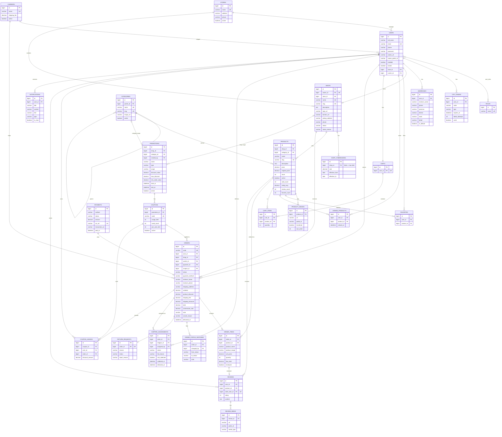

# StarShop – Thiết kế cơ sở dữ liệu

## 1. Nguyên tắc chung

- Mọi entity kế thừa `BaseEntity` (`@MappedSuperclass`): `id` (BIGINT, auto increment), `created_at`, `updated_at`
  (tự điền bằng `@CreationTimestamp` / `@UpdateTimestamp` của Hibernate).
- Tên bảng/cột tiếng Anh, dạng `snake_case`. Bảng đơn hàng đặt tên `orders` (vì `ORDER` là từ khóa SQL).
- Tiền: `BigDecimal` ↔ `DECIMAL(15,2)`. Tỉ lệ %: `DECIMAL(5,2)`.
- Enum lưu dạng chuỗi (`@Enumerated(EnumType.STRING)`) để không lệch dữ liệu khi thêm giá trị mới.
- Không xóa cứng dữ liệu đã phát sinh giao dịch (sản phẩm, shop, danh mục…): dùng cờ `active` / trạng thái.
- **Snapshot trong đơn hàng:** tên, ảnh, giá sản phẩm, địa chỉ nhận hàng, phí ship, % chiết khấu được **chép vào đơn**
  lúc đặt, để sau này sản phẩm đổi giá hoặc user sửa địa chỉ thì đơn cũ vẫn đúng.
- Một số cột thống kê được **lưu sẵn** trên `products` (`sold_count`, `rating_avg`, `review_count`, `favorite_count`)
  để sắp xếp "bán chạy / đánh giá cao / yêu thích nhất" nhanh, cập nhật trong service khi có đơn giao thành công,
  đánh giá mới, bấm thích.

### Quyết định của nhóm

| Vấn đề | Quyết định |
|---|---|
| Store ↔ Shop | Mỗi Shop thuộc 1 Store; Admin gán Store khi duyệt shop (`store_id` NULL khi còn chờ duyệt). Manager quản lý dữ liệu của các shop trong Store của mình |
| Vendor ↔ Shop | Mỗi vendor có đúng 1 shop (`shops.owner_id` UNIQUE) |
| User hủy đơn | Chỉ khi đơn còn `NEW`. Đã `CONFIRMED` thì liên hệ shop |
| Carrier | Dùng chung toàn chuỗi (không gắn Store). Admin quản lý, Manager chỉ xem |

## 2. Enum

| Enum | Giá trị |
|------|---------|
| `RoleName` | `USER`, `VENDOR`, `MANAGER`, `ADMIN`, `SHIPPER` (Guest = chưa đăng nhập, không lưu) |
| `OrderStatus` | `NEW`, `CONFIRMED`, `PICKED_UP`, `SHIPPING`, `DELIVERED`, `CANCELLED`, `RETURN_REQUESTED`, `REFUNDED` |
| `PaymentMethod` | `COD`, `VNPAY`, `MOMO` |
| `PaymentStatus` | `PENDING`, `PAID`, `FAILED`, `CANCELLED`, `REFUNDED` |
| `PromotionType` | `PRODUCT_PERCENT` (giảm % giá sản phẩm), `SHIPPING_DISCOUNT` (giảm phí vận chuyển) |
| `PromotionScope` | `PLATFORM` (toàn sàn), `CATEGORY` (theo danh mục), `SHOP` (theo shop) |
| `ShopStatus` | `PENDING`, `APPROVED`, `REJECTED`, `SUSPENDED` |
| `OtpType` | `REGISTER`, `RESET_PASSWORD` |
| `MediaType` | `IMAGE`, `VIDEO` |
| `AssignmentStatus` | `ASSIGNED`, `DELIVERING`, `DELIVERED`, `FAILED` |
| `ReturnStatus` | `PENDING`, `APPROVED`, `REJECTED` |
| `NotificationType` | `ORDER`, `SHOP`, `PROMOTION`, `SYSTEM` |

Luồng trạng thái đơn hàng:
`NEW → CONFIRMED → PICKED_UP → SHIPPING → DELIVERED`;
nhánh phụ `NEW/CONFIRMED → CANCELLED`, `DELIVERED → RETURN_REQUESTED → REFUNDED`.

## 3. Danh sách entity

### Nhóm người dùng & xác thực

| Entity (bảng) | Cột chính | Quan hệ / ràng buộc |
|---|---|---|
| **User** (`users`) | `full_name`, `email` (UK), `phone`, `password` (BCrypt), `avatar_url`, `avatar_public_id`, `enabled` (đã kích hoạt OTP), `locked` | N-N `Role` qua `user_roles`; N-1 `Store` (chỉ MANAGER); N-1 `Carrier` (chỉ SHIPPER) |
| **Role** (`roles`) | `name` (`RoleName`, UK) | |
| **OtpToken** (`otp_tokens`) | `code` (6 số), `type` (`OtpType`), `expires_at`, `failed_attempts`, `used` | N-1 `User`. Gửi lại sau 60s dựa vào `created_at` |
| **Address** (`addresses`) | `receiver_name`, `phone`, `province`, `district`, `ward`, `detail`, `is_default` | N-1 `User` |

### Nhóm chuỗi cửa hàng & shop

| Entity (bảng) | Cột chính | Quan hệ / ràng buộc |
|---|---|---|
| **Store** (`stores`) | `name` (UK), `address`, `phone`, `active` | Chi nhánh của chuỗi. 1-N `User` (manager), 1-N `Shop` |
| **Shop** (`shops`) | `name` (UK), `slug` (UK), `description`, `logo_url`, `banner_url`, `pickup_address`, `phone`, `status` (`ShopStatus`), `status_reason` | 1-1 `User` (owner, vendor); N-1 `Store` |
| **ShopCommission** (`shop_commissions`) | `rate` (0–100 %), `effective_from`, `effective_to` | N-1 `Shop`, **`shop_id` = NULL là mức mặc định toàn sàn** |
| **Carrier** (`carriers`) | `name` (UK), `shipping_fee` (≥ 0), `active` | 1-N `User` (shipper) |

### Nhóm sản phẩm

| Entity (bảng) | Cột chính | Quan hệ / ràng buộc |
|---|---|---|
| **Category** (`categories`) | `name` (UK), `slug` (UK), `image_url`, `active` | N-1 `Category` (cha, tùy chọn) |
| **Product** (`products`) | `name`, `slug` (UK), `description` (TEXT), `price` (> 0), `original_price`, `stock` (≥ 0), `active`, `sold_count`, `rating_avg`, `review_count`, `favorite_count` | N-1 `Shop`, N-1 `Category` |
| **ProductImage** (`product_images`) | `url`, `public_id` (Cloudinary), `thumbnail`, `sort_order` | N-1 `Product` |
| **Favorite** (`favorites`) | | N-1 `User`, N-1 `Product`, UK (`user_id`, `product_id`) |
| **ViewedProduct** (`viewed_products`) | `viewed_at` | N-1 `User`, N-1 `Product`, UK (`user_id`, `product_id`) — xem lại thì cập nhật `viewed_at` |

### Nhóm giỏ hàng & đơn hàng

| Entity (bảng) | Cột chính | Quan hệ / ràng buộc |
|---|---|---|
| **Cart** (`carts`) | | 1-1 `User` |
| **CartItem** (`cart_items`) | `quantity` (≥ 1) | N-1 `Cart`, N-1 `Product`, UK (`cart_id`, `product_id`) |
| **Order** (`orders`) | `code` (UK, mã đơn hiển thị), `status`, `payment_method`, snapshot địa chỉ (`receiver_name`, `receiver_phone`, `shipping_address`), `subtotal`, `product_discount`, `shipping_fee`, `shipping_discount`, `total`, `commission_rate` (snapshot), `note`, `cancel_reason`, `delivered_at` | N-1 `User` (người mua), N-1 `Shop` (**mỗi đơn thuộc 1 shop** — checkout tự tách theo shop), N-1 `Carrier`, N-1 `Payment`, N-1 `Coupon` (tùy chọn) |
| **OrderItem** (`order_items`) | snapshot `product_name`, `product_image`, `unit_price`, `quantity`, `line_total`, `reviewed` | N-1 `Order`, N-1 `Product` |
| **OrderStatusHistory** (`order_status_histories`) *(đề xuất thêm)* | `from_status`, `to_status`, `note` | N-1 `Order`, N-1 `User` (người đổi). Phục vụ "lịch sử trạng thái" ở trang chi tiết đơn |
| **ReturnRequest** (`return_requests`) *(đề xuất thêm)* | `reason`, `status` (`ReturnStatus`), `reject_reason`; ảnh lưu bảng phụ `return_request_images` | 1-1 `Order` |
| **Payment** (`payments`) | `method`, `status`, `amount`, `txn_ref` (UK, mã gửi cổng thanh toán), `transaction_no` (mã của VNPAY/MOMO), `paid_at` | 1-N `Order`: một lần thanh toán online trả cho **nhiều đơn** tách từ cùng một checkout; COD thì mỗi đơn một payment |
| **ShipperAssignment** (`shipper_assignments`) | `status` (`AssignmentStatus`), `fail_reason`, `cod_collected`, `collected_at`, `delivered_at` | N-1 `Order`, N-1 `User` (shipper), N-1 `User` (người phân công). Một đơn có thể phân công lại khi giao thất bại |

### Nhóm khuyến mãi

| Entity (bảng) | Cột chính | Quan hệ / ràng buộc |
|---|---|---|
| **Promotion** (`promotions`) | `name`, `description`, `type` (`PromotionType`), `scope` (`PromotionScope`), `discount_value` (% hoặc số tiền giảm ship), `max_discount`, `min_order_value`, `start_at`, `end_at` (> start), `active` | N-1 `Shop` (khi scope = SHOP), N-1 `Category` (khi scope = CATEGORY), N-1 `User` (người tạo) |
| **Coupon** (`coupons`) | `code` (UK), `usage_limit`, `used_count`, `per_user_limit`, `active` | N-1 `Promotion`. Promotion **không có coupon** = tự áp dụng (hiển thị nhãn giảm giá); **có coupon** = phải nhập mã |
| **CouponUsage** (`coupon_usages`) | `discount_amount` | N-1 `Coupon`, N-1 `User`, N-1 `Order`. Hủy đơn → xóa bản ghi và giảm `used_count` |

### Nhóm đánh giá & thông báo

| Entity (bảng) | Cột chính | Quan hệ / ràng buộc |
|---|---|---|
| **Review** (`reviews`) | `rating` (1–5), `content` (TEXT, ≥ 50 ký tự) | N-1 `User`, N-1 `Product`, 1-1 `OrderItem` (UK — mỗi sản phẩm trong mỗi đơn đánh giá 1 lần) |
| **ReviewMedia** (`review_media`) | `url`, `public_id`, `media_type` (`MediaType`) | N-1 `Review` (tối đa 5 ảnh + 1 video, kiểm tra ở service) |
| **Notification** (`notifications`) | `title`, `content`, `link`, `type` (`NotificationType`), `is_read` | N-1 `User` |

## 4. ERD

> Các bảng đều có thêm `created_at`, `updated_at` (từ `BaseEntity`), không vẽ lại trong sơ đồ cho gọn.
